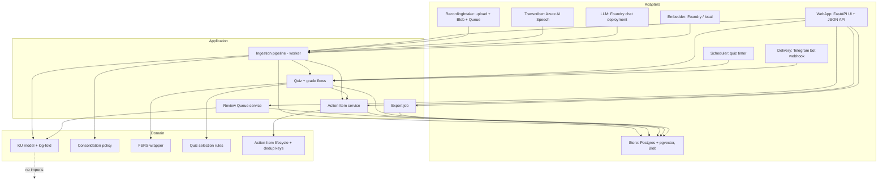
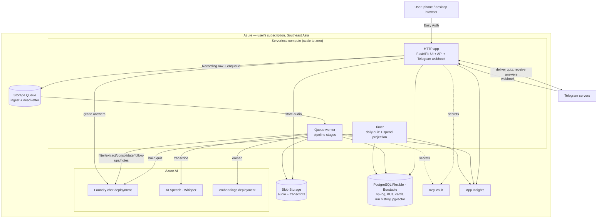
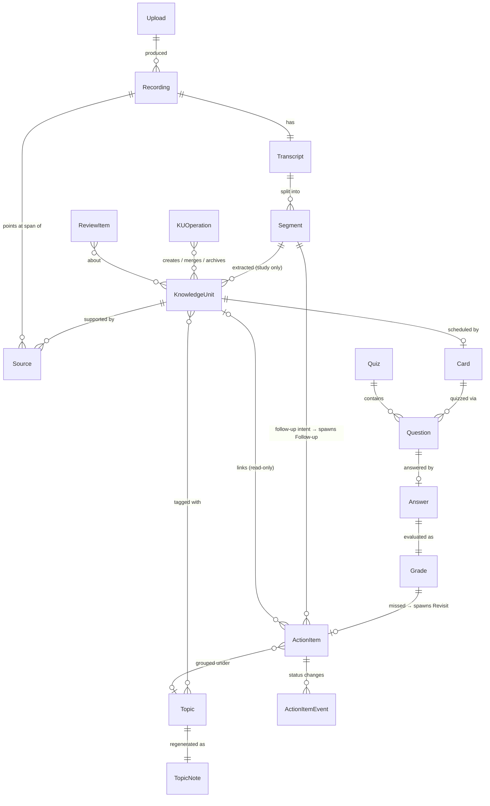
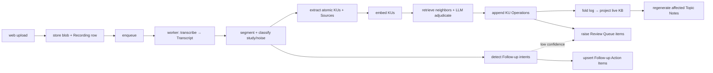

# Architecture Spine — Quizme

## Design Paradigm

**Hexagonal (ports & adapters) core, fed by a pipes-and-filters ingestion pipeline, with the knowledge base stored as an append-only operation log that is folded into current state.**

- **Domain** — pure logic, no I/O: the KU model, consolidation policy (how an LLM verdict becomes KU Operations), the FSRS wrapper, question/quiz selection rules, Action Item lifecycle + dedup-key rules, the log-fold. Depends on nothing external.
- **Application** — orchestrates the ingestion pipeline as discrete idempotent stages (`transcribe → filter → extract → consolidate → project → regenerate-notes`), plus the `quiz`, `grade`, `action-items`, and `review-queue` flows, and the `export` job. Extraction emits two outputs: KUs and candidate Follow-up Action Items; grading emits Revisit Action Items.
- **Adapters** — implement ports defined by the core:
  - `RecordingIntake` — the web upload handler + Azure Blob (immutable object store) + Azure Storage Queue (pipeline trigger).
  - `Transcriber` — **Azure AI Speech** batch / fast transcription (Whisper model), available in Southeast Asia (Azure OpenAI Whisper is not — AD-13).
  - `LLM` — Azure AI Foundry chat deployment (OpenAI-compatible), default model + per-stage overrides pinned in config (AD-8).
  - `Embedder` — a Foundry embeddings deployment (or a small in-process model); vectors stored in Postgres `pgvector`.
  - `Store` — Azure Database for PostgreSQL Flexible Server (op-log, KUs, Cards, Action Items, Review Queue, run history) + Blob (audio, transcripts).
  - `Delivery` — Telegram bot (webhook) for the daily quiz.
  - `WebApp` — FastAPI (ASGI) app: the authenticated UI + JSON API over the application layer (AD-10).
  - `Clock`, `Scheduler` (timer for the daily quiz), `SpendMeter` (FR-38, FR-53).
- **Serverless-first, three trigger types (AD-16, AD-17, AD-19):** an **HTTP function/app** (FastAPI ASGI — UI, JSON API, Telegram webhook), a **timer function** (daily quiz build + push; spend projection), and a **queue-triggered worker** (drains `ingest`, runs the pipeline). All scale to zero between work; none calls another in-process — they share only Postgres + the queue. Postgres Flexible Server (Burstable) is the sole always-billing component. Hostable on Azure Functions (Flex Consumption) or Container Apps (min-replicas 0); App Service is the fallback but conflicts with the dev/test credit terms (see Deferred).

Directory ↔ layer mapping is in **Structural Seed**.

## Invariants & Rules

### AD-1 — Raw artifacts are immutable and retained *(ADOPTED — from PRD FR-2, FR-20)*

- **Binds:** ingestion, transcription, storage; all rebuild paths.
- **Prevents:** losing the ability to rebuild the knowledge base when filter/extraction/consolidation logic improves; irrecoverable data loss.
- **Rule:** Recording originals and Transcripts are written once to content-addressed storage and never mutated or deleted by any pipeline stage. The system must be able to reconstruct the entire knowledge base from `{Recordings + Transcripts}` alone.

### AD-2 — Knowledge Units are the only source of truth; Topic Notes are always derived

- **Binds:** knowledge base, Topic Notes, extraction, quiz, search.
- **Prevents:** two divergent representations of the same knowledge; a hand-edit to a note being silently lost.
- **Rule:** No process may read a Topic Note as input to another process. Topic Notes are regenerated from live KUs and are display-only. Any edit intent targets the KU layer via a KU Operation (AD-3).

### AD-3 — The knowledge base is a projection of an append-only KU Operation log

- **Binds:** consolidation, manual edits, storage, rebuild.
- **Prevents:** irreversible LLM merges; inability to audit why knowledge changed; divergence between "what the engine did" and "what the KB shows".
- **Rule:** Every knowledge change (`create`, `merge`, `elaborate`, `flag_contradiction`, `split`, `archive`, `edit`, `retopic`) is appended as one KU Operation carrying: actor (`engine` | `user`), timestamp, model id + prompt version + prompt hash (if LLM-driven), input KU ids, rationale. Live KB state = deterministic fold of the log. Superseded KUs are tombstoned (id retained, pointer to survivor), never row-deleted.

### AD-4 — Pipeline stages are idempotent, keyed by content hash + stage version

- **Binds:** every ingestion pipeline stage; the queue worker.
- **Prevents:** duplicate KUs from re-processing the same Recording; corruption from partial failures, retries, and at-least-once queue delivery.
- **Rule:** Before running, a stage checks `(input_hash, stage_version)` against a processed-ledger in Postgres; if present, it is a no-op. A stage-version bump (prompt/model/logic change) is the *only* way to force reprocessing. Stages must be safe to kill and re-run at any point. Because the Storage Queue delivers **at least once**, every worker handler is idempotent on the message's Recording id and does not rely on exactly-once semantics.

### AD-5 — Provenance is union-only

- **Binds:** consolidation, manual merge.
- **Prevents:** losing the trail from a KU back to every Recording span that supports it.
- **Rule:** On any merge or elaboration, the survivor's `sources` is the set union of all inputs' Sources. No operation removes a Source except an explicit user `edit` op (PRD FR-35), and a KU with zero Sources must be archived.

### AD-6 — Consolidation is always scoped; no whole-corpus LLM pass

- **Binds:** consolidation engine, per-Topic reorganization.
- **Prevents:** unbounded cost; nondeterministic mass rewrites; context-window failures as the KB grows.
- **Rule:** An LLM consolidation call receives at most **one Recording's candidate KUs plus their top-k retrieval neighbors**, or **one Topic's KUs**. Never more. Retrieval bound `k` and Topic-reorg trigger threshold are config.

### AD-7 — Contradictions are never auto-resolved

- **Binds:** consolidation, Review Queue, quiz selection.
- **Prevents:** silently overwriting the user's knowledge with a wrong "correction"; the engine acting as an authority it is not.
- **Rule:** A `contradiction` verdict produces a `flag_contradiction` op and a Review Queue item holding both KUs intact. Neither KU is edited, merged, or archived until a `user`-actor op resolves it. Both are suppressed from quizzes while the flag is open (config-overridable).

### AD-8 — All model access goes through one port, with model + prompt pinned in versioned config

- **Binds:** every LLM and STT use (filter, extract, consolidate, follow-up detection, question generation, grade, note-regen).
- **Prevents:** silent model drift changing KB behavior; per-stage prompt sprawl; untraceable outputs; uncontrolled spend.
- **Rule:** A single `LLM` port (Azure Foundry chat deployment) and a single `Transcriber` port (Azure AI Speech). Config has one default chat model plus **per-stage overrides**: v1 runs a top-tier model everywhere, but a stage can be pointed at a cheaper deployment without code change (budget lever, PRD §5.2, FR-53). Per-stage differences are `{deployment, sampling params, prompt template}`, each addressed by a `prompt_version`. Every call logs `{prompt_version, prompt_hash, model, input_tokens, output_tokens, latency_ms, est_cost_usd}` and feeds `SpendMeter` (FR-38). Changing deployment / params / template bumps the dependent stage version (AD-4).

### AD-13 — Inference and data stay within the user's Azure tenant *(ADOPTED — user decision: Azure hosting, VS Enterprise $150/mo credit)*

- **Binds:** every `LLM`, `Transcriber`, `Embedder`, and `Store` use.
- **Prevents:** personal study content going to a third-party consumer model API; data spread across providers; vendor lock-in that blocks the credit-lapse exit.
- **Rule:** All model calls target **Azure AI Foundry / Azure AI Speech deployments in the user's own subscription** (region **Southeast Asia**); no `api.openai.com` / `api.anthropic.com` / other consumer endpoints. All persistent data lives in the user's Azure Postgres and Blob. The only outbound traffic outside Azure is the `Delivery` adapter to Telegram (PRD §5.2), carrying generated Questions, model answers, and user Answers only — never audio, Transcripts, Sources, Topic Notes, or the KB. The op-log and export format carry no Azure-proprietary types, so AD-18's local fallback stays viable.
- **Model-region facts (as provisioned 2026-09-06):** transcription is Azure AI Speech (region-pinned to Southeast Asia) because Azure OpenAI Whisper is not there. **Regional and DataZone chat/embedding deployments are NOT usable on this subscription/region:** the top chat models offer no plain-Standard SKU in Southeast Asia, top-tier models (`gpt-4.1`, `gpt-5.2`, `gpt-5.4`) have **zero default quota** here (needs a quota-increase request), and `DataZoneStandard` deployments were created but returned `DeploymentNotFound` at the endpoint. v1 therefore runs **`GlobalStandard`** (`gpt-5-mini` chat, `text-embedding-3-small` embeddings) — which contradicts this AD's "never Global" intent. **This is a known, documented compromise (PRD §5.2), not a silent override.** Closing it: a quota-increase request for a top-tier model on `DataZoneStandard` restores in-geo processing *and* raises judgement-stage quality; then flip `[llm].default_deployment` or the per-stage overrides.

### AD-14 — *(withdrawn)*

Previously: "STT and LLM inference are never co-resident" — a memory-budget rule for the 16 GB local-Mac deployment. Obsolete on Azure, where transcription and LLM calls are separate managed endpoints with no shared memory. The `resource_class` tag is dropped. **ID retained, not reused.**

### AD-15 — Consolidation is biased toward under-merging

- **Binds:** consolidation policy (`domain/consolidation.py`).
- **Prevents:** a confident-but-wrong `duplicate` / `elaboration` verdict collapsing distinct KUs and losing information that is hard to recover in practice.
- **Rule:** A `duplicate` or `elaboration` verdict auto-applies **only** above a configured confidence threshold; below it, the new KU is inserted as `create` and a low-priority Review Queue item proposes the merge. `contradiction` always goes to the queue (AD-7). This is defense-in-depth (an un-merged duplicate is cheaply fixed later by FR-16 or a manual merge; an over-merge is not), independent of how capable the model is.

### AD-16 — Recording intake is upload-triggered and asynchronous

- **Binds:** `RecordingIntake`, the web process, the queue worker.
- **Prevents:** a slow pipeline blocking the HTTP upload; a Recording lost because processing failed after the request returned; the web and worker processes coupling in-process.
- **Rule:** The web process, on upload, (1) streams the file to Blob, (2) computes its content hash and creates the Recording row (or detects the duplicate), (3) enqueues one Storage Queue message per new Recording, then returns success. Blob write + Recording row + enqueue is the acceptance boundary — after it, the file is safe even if the worker is down. The **worker never reads from the web process and the web process never runs a pipeline stage**; they communicate only through Postgres + the queue.

### AD-17 — All durable state is in managed storage; the app filesystem is ephemeral

- **Binds:** every component.
- **Prevents:** data loss on App Service restart / redeploy / scale; SQLite-style single-file fragility; logs vanishing on redeploy.
- **Rule:** Nothing durable is written to local disk. The op-log, KUs, Cards, Action Items, Review Queue, run history, and `SpendMeter` totals live in Postgres; audio and transcripts in Blob; embeddings in `pgvector`. Schema changes are forward-only migrations applied on deploy. Logs and metrics go to Azure (App Insights / Log Analytics), not files.

### AD-18 — The system stays exportable and re-hostable

- **Binds:** `Store`, `LLM`, `Transcriber`, `Embedder` ports; the `export` job.
- **Prevents:** the temporary Azure credits becoming a lock-in that makes moving back to local infeasible.
- **Rule:** An on-demand `export` produces a portable bundle: a Postgres logical dump (standard SQL, `pgvector` values as arrays) + a Blob manifest + the config. Every port has a documented local implementation path (`LLM`→Ollama, `Transcriber`→whisper.cpp, `Store`→SQLite + sqlite-vec, `Embedder`→local model). No domain or op-log type may depend on an Azure SDK class. Building and testing the local deployment is deferred (PRD §6.2) but must never be *designed out*.

### AD-19 — Degrade before the credit cap *(ADOPTED — Visual Studio credit is a hard cap)*

- **Binds:** the timer function (spend projection), the queue worker, `SpendMeter`, `RecordingIntake`.
- **Prevents:** the subscription's hard spending limit being hit mid-month, which **disables all services** — taking the daily quiz offline too, not just ingestion.
- **Rule:** `SpendMeter` projects month-end spend after every run. Above a configured danger threshold the worker enters **throttled** mode: it stops dequeuing new ingestion work and skips the per-Topic reorg (FR-16), while the daily quiz, grading, and any in-flight Recording finish normally. Uploads are still accepted and stored to Blob (cheap) and their queue messages left for the next period. Throttle engage/clear is logged and pushed to Telegram (FR-53). The threshold and the monthly budget figure are user settings (FR-52).

### AD-9 — Scheduling / retention state is owned by the quiz scheduler and is not knowledge

- **Binds:** quiz, grading, knowledge base.
- **Prevents:** FSRS state coupling to or corrupting the KB; quiz generation writing into KUs.
- **Rule:** FSRS Card state lives in its own store keyed by `ku_id`, owned solely by the quiz/grade flows. Quiz generation and grading read KUs **read-only**. Deleting all Card state must not affect the KB; rebuilding the KB must not silently discard Card history (Cards for tombstoned KUs are retired, not dropped).

### AD-10 — Single user; authentication at the platform edge *(ADOPTED — from PRD §2.2, §4.12)*

- **Binds:** entire system; `WebApp`, `Delivery`.
- **Prevents:** premature multi-tenant complexity in schema and logic; application code re-implementing auth.
- **Rule:** The core assumes one implicit identity — no user table, no per-row ownership. Two ingress points, each authenticating before application code runs: the **web app** behind built-in auth ("Easy Auth", Entra ID) — locked to one identity via *assignment required* on the enterprise app **and** an `oid`/`preferred_username` allowlist check in middleware (belt and braces) (FR-46) — and the **Telegram webhook** validated by `X-Telegram-Bot-Api-Secret-Token` + a hard allowlist of one chat id. No other inbound routes. A second user would be a new epic, not a v1 seam.

### AD-11 — Dependency direction: adapters → application → domain

- **Binds:** all modules.
- **Prevents:** infrastructure concerns (SQLite, HTTP, file paths, vendor SDKs) leaking into domain logic; an untestable core.
- **Rule:** `domain` imports no I/O library and no adapter. `application` imports `domain` and port *interfaces* only. `adapters` import `application`/`domain` to implement ports. Dependencies point inward only.

### AD-12 — Action Items are tracked task state, not knowledge

- **Binds:** extraction (Follow-up detection), grading (Revisit creation), the Action Item service, knowledge base, Cards.
- **Prevents:** to-do state coupling into the KU Operation log; duplicate items piling up from repeated triggers; a "done" checkbox silently altering the spaced-repetition schedule.
- **Rule:** Action Items live in their own store keyed by `action_item_id`, owned solely by the Action Item service. Each has a dedup key — `("revisit", ku_id)` for Revisit items, `("follow_up", topic_id, intent_hash)` for Follow-ups — and creation is **upsert on that key** (`trigger_count++`, Sources unioned), never blind insert. KU Operations never reference Action Items; Action Items reference KUs / Sources / Topics **read-only**. Resolving or deleting an Action Item writes no KU Operation and touches no Card. The only automatic KB→ActionItem effect is the FR-45 read-only signals (KU answered `correct`×2 → auto-resolve; Topic gained KUs → "possibly addressed" flag).



## Consistency Conventions

| Concern | Convention |
| --- | --- |
| Identifiers | UUIDv7 (time-ordered) for all entity ids: `upload_id`, `recording_id`, `transcript_id`, `segment_id`, `ku_id`, `op_id`, `topic_id`, `card_id`, `quiz_id`, `question_id`, `review_item_id`, `action_item_id`. Blob object keys are `recordings/<sha256>` / `transcripts/<recording_id>.json`; the SHA-256 of the audio is also the dedup key on `recording`. |
| Topic slug | lowercase kebab-case, ASCII, generated from the Topic label; label is display, slug is the key. |
| Dates & times | ISO 8601, UTC, stored as `TEXT` (`...Z`). Audio offsets are float seconds from recording start. |
| Naming | Entities singular PascalCase in code (`KnowledgeUnit`), snake_case tables/columns (`knowledge_unit`), verbs for pipeline stages (`extract`, `consolidate`). Ports are `XxxPort` protocols; adapters are `XxxAdapter`. |
| KU Operation shape | `{op_id, ts, actor, type, ku_ids_in[], ku_id_out?, payload, model?, prompt_version?, prompt_hash?, rationale?}`. Append-only table; no `UPDATE`, no `DELETE`. |
| Action Item shape | `{action_item_id, origin, status, dedup_key, trigger_text, sources[], ku_id?, topic_id?, trigger_count, revisit_at?, created_at, updated_at, resolved_at?, resolution?}`. `dedup_key` is unique; writes are upsert on it (AD-12). Status transitions are logged as `action_item_event` rows. |
| Error shape | Domain raises typed `QuizmeError` subclasses; adapters translate vendor errors at the boundary. Pipeline stage failures are caught, logged as a `stage_run` row with `status=failed` + traceback, retried with backoff, and parked after N attempts — never crash the worker (PRD FR-36). |
| Queue handling | Storage Queue = at-least-once; every worker handler is idempotent on `recording_id` (AD-4). Poison messages → dead-letter queue after N dequeues, surfaced in run history. Visibility timeout ≥ the longest stage. |
| LLM call logging | Every call → one `llm_call` row: `{ts, stage, prompt_version, prompt_hash, model, input_tokens, output_tokens, latency_ms, est_cost_usd, confidence?}`; totals roll up into `spend_month` (FR-38). |
| Config | `config.toml` in the repo for non-secret defaults; per-environment values as App Service settings. `[llm]` pins the Foundry `endpoint` + default `deployment` + per-stage overrides + thresholds. **Secrets only in Azure Key Vault, read via Managed Identity** — never in env vars, never in the repo (AD-17). |
| Auth | Web app behind App Service Easy Auth, one allowed identity; Telegram webhook validated by `X-Telegram-Bot-Api-Secret-Token` + single-chat-id allowlist (AD-10). |
| Logging | Structured logs to stdout → App Insights / Log Analytics; one `run_id` per pipeline or quiz run threaded through all lines; retained per Azure retention config, not on the app filesystem (AD-17). |
| Determinism | LLM sampling `temperature=0` (fixed `seed` where the deployment supports it) for filter/extract/consolidate/grade/follow-ups; question generation may use a low non-zero temperature. Structured output enforced via the model's JSON-schema / structured-output mode. |
| Migrations | Alembic, forward-only, numbered; applied on deploy before the new revision serves traffic. |

## Stack

*Seed — verified current as of 2026-09-06; the code owns exact pins once it exists. Rationale in the conversation, not here.*

*Seed — verified plausible as of 2026-09-06; confirm exact SKUs and prices in **Southeast Asia** at provisioning. Top-tier chat model confirmed deployable there. Rough all-in: ~$55–100/mo (PRD §5.2).*

| Name | Version / SKU / notes |
| --- | --- |
| Python | 3.12+ |
| uv (packaging) | latest |
| FastAPI (ASGI) | latest — UI + JSON API + Telegram webhook; runs as the HTTP function/app |
| Jinja2 (or htmx + minimal JS) | server-rendered UI; keep the frontend thin (PRD FR-52 NFR) |
| **Compute — serverless-first** | **Azure Functions (Flex Consumption)** or **Azure Container Apps (min-replicas 0)**: one HTTP app (FastAPI via ASGI/`azure-functions`), one timer trigger (daily quiz + spend projection), one Storage-Queue trigger (pipeline worker). Scale to zero between work (AD-16, AD-19). App Service B1 is the fallback — see Deferred. |
| **Azure Database for PostgreSQL Flexible Server** | **provisioned:** `psql-quizme-96616d`, Burstable **B1ms**, 32 GB, PG 16, `pgvector` 0.8.2 enabled, db `quizme`, migration `0001` applied. Firewall: my IP + Azure services. The one always-billing component, ~$15–20/mo. |
| **Azure Blob Storage** | **provisioned:** `stquizme96616d`, Standard LRS, containers `recordings` / `transcripts`, queues `ingest` / `ingest-poison`. Lifecycle → Cool (PRD Open Q 7) TODO. |
| **Azure AI Foundry — chat deployment** | **provisioned:** `gpt-5-mini` (2025-08-07) on `GlobalStandard`, deployment name `chat`, 50K TPM, resource `aoai-quizme-96616d` (Southeast Asia). Top-tier + DataZone blocked by quota (see AD-13 note / PRD §5.2). Per-stage overrides in config (AD-8). |
| **Azure AI Speech** | **provisioned:** `spch-quizme-96616d`, S0, Southeast Asia. Batch/fast transcription (Whisper), word + segment timestamps, duration-billed. |
| **Azure AI Foundry — embeddings deployment** | **provisioned:** `text-embedding-3-small` on `GlobalStandard`, deployment `embed`, 1536 dims. Local model is the AD-18 fallback. |
| **Azure Key Vault** | **provisioned:** `kv-quizme-96616d`, RBAC auth. Holds `database-url`, `pg-admin-password`, `aoai-api-key`, `speech-api-key`, `web-allowed-principal`. App reads via **Managed Identity** (AD-17); keys are the local-dev / fallback path. Telegram secrets TODO (needs a bot). |
| **Azure Application Insights / Log Analytics** | logs, traces, request metrics (AD-17). **Not yet provisioned** (created with the Function App). |
| SQLAlchemy 2.x + Alembic | ORM + forward-only migrations |
| `pgvector` Python bindings | vector column type + KNN queries |
| fsrs (`py-fsrs`) | 6.3.x |
| python-telegram-bot | 22.x — **webhook mode** |
| openai (Python SDK) or `azure-ai-inference` | client for the Foundry endpoint |
| `azure-cognitiveservices-speech` / Speech batch REST | client for AI Speech transcription |
| pytest | latest |
| GitHub Actions → Functions/Container Apps | deploy pipeline; Alembic upgrade as a release step |
| *(AD-18 fallback, not built in v1)* Ollama · whisper.cpp · SQLite + sqlite-vec · APScheduler | the documented local re-host path |

## Structural Seed

### Container / deployment view



*Everything except the Telegram hop is inside the user's Azure tenant (AD-13). The Telegram hop carries Questions and Answers only.*

### Core entities (ERD — names + relationships only)



### Ingestion pipeline (pipes-and-filters)



Steps `U`→`Q` run in the **web process** (AD-16, synchronous, returns after enqueue). Steps `C`→`M` run in the **worker**, each idempotent (AD-4). Grade flow (web process, on Telegram answer): `answer graded` → `missed` → `upsert Revisit Action Item`; `correct`×2 on a linked KU → `auto-resolve Revisit item`.

### Source tree

```text
quizme/
  pyproject.toml
  config.toml            # non-secret defaults only (AD-17)
  quizme/
    domain/              # AD-11 inner ring — no I/O, no Azure SDK (AD-18)
      ku.py              # KnowledgeUnit, Source, KUOperation, log-fold
      consolidation.py   # verdict -> operations policy (AD-3, AD-5, AD-7, AD-15)
      scheduling.py      # FSRS wrapper (AD-9)
      selection.py       # daily quiz selection rules
      action_items.py    # ActionItem model, dedup keys, lifecycle rules (AD-12)
      errors.py
    application/         # orchestration; imports domain + port protocols
      ports.py           # RecordingIntake, Transcriber, LLM, Embedder, Store, Delivery, WebApp, Clock, Scheduler, SpendMeter
      pipeline/          # one module per stage (AD-4 idempotent)
        transcribe.py  filter.py  extract.py  followups.py  consolidate.py  project.py  notes.py
      quiz.py            # generate + deliver + grade flows
      review_queue.py
      action_items.py    # upsert/dedup/lifecycle service (AD-12); FR-39..FR-45
      queue_worker.py    # dequeue → run pipeline stages; idempotent per Recording (AD-16)
      spend.py           # SpendMeter — rolls up llm_call rows; projection, warn, throttle (FR-38, FR-53, AD-19)
      export.py          # portable bundle (AD-18); FR (§6.1)
    adapters/
      intake_azure.py    # RecordingIntake — upload handler + Blob + Queue (AD-16)
      transcriber_speech.py    # Transcriber — Azure AI Speech batch/fast transcription (AD-13)
      llm_foundry.py     # LLM — Foundry chat deployment, per-stage overrides (AD-8, AD-13)
      embedder_foundry.py
      store_postgres.py  # Store — Postgres + pgvector + Blob, isolated (AD-3, AD-9, AD-17)
      delivery_telegram.py     # Delivery — bot webhook (AD-10)
      # AD-18 fallback stubs, not wired in v1:
      llm_ollama.py  transcriber_whisper_cpp.py  store_sqlite.py  embedder_local.py
    web/                 # WebApp adapter — FastAPI
      app.py  auth.py    # Easy Auth + principal allowlist (AD-10)
      routes/            # upload, ingestion status, review queue, browse, todo, retention/settings
      templates/  static/
    prompts/             # versioned templates; filename carries prompt_version
    migrations/          # Alembic, forward-only
  functions/             # serverless host: HTTP (→ web/app ASGI), timer (quiz + spend), queue (→ application/queue_worker)
  infra/                 # provisioning scripts / Bicep (deferred depth — see Deferred)
  .github/workflows/     # deploy → Functions/Container Apps, run Alembic
  tests/
```

## Capability → Architecture Map

| Capability / FR | Lives in | Governed by |
| --- | --- | --- |
| FR-1..FR-4 upload ingestion & transcription | `adapters/intake_azure.py`, `adapters/transcriber_speech.py`, `application/pipeline/transcribe.py`, `application/queue_worker.py` | AD-1, AD-4, AD-8, AD-13, AD-16, AD-17 |
| FR-5..FR-7 relevance filtering | `application/pipeline/filter.py`, `prompts/` | AD-4, AD-8, AD-13 |
| FR-8..FR-10 extraction | `application/pipeline/extract.py`, `domain/ku.py` | AD-4, AD-5, AD-8, AD-13 |
| FR-11..FR-16 consolidation | `application/pipeline/consolidate.py`, `domain/consolidation.py` | AD-3, AD-5, AD-6, AD-7, AD-8, AD-13, AD-15 |
| FR-17..FR-20 knowledge base & Topic Notes | `domain/ku.py` (fold), `application/pipeline/project.py`, `notes.py` | AD-2, AD-3, AD-1 (rebuild), AD-17 |
| FR-21..FR-23 Review Queue | `application/review_queue.py`, `web/routes/` | AD-7, AD-3 |
| FR-24..FR-28 quiz scheduling & generation | `domain/scheduling.py`, `domain/selection.py`, `application/quiz.py` | AD-9, AD-8 |
| FR-29..FR-32 grading & retention | `application/quiz.py`, `domain/scheduling.py`, `web/routes/` | AD-9, AD-8, AD-13 |
| FR-33..FR-35 manual corrections | `application/review_queue.py`, `domain/ku.py`, `web/routes/` | AD-3, AD-5 |
| FR-36..FR-38, FR-53 operability, spend & degrade | `functions/`, `application/queue_worker.py`, `application/spend.py`, App Insights | AD-4, AD-8, AD-16, AD-17, AD-19, conventions |
| FR-39..FR-45 action items | `domain/action_items.py`, `application/action_items.py`, `application/pipeline/followups.py` | AD-12, AD-8, AD-9 (no Card writes), AD-7 |
| FR-46..FR-52 web app | `web/` (`app.py`, `auth.py`, `routes/`, `templates/`) | AD-10, AD-11 (thin surface), AD-16, AD-17 |
| Export (§6.1) | `application/export.py` | AD-18 |

## Deferred

- **Internet fact-validation (PRD §5, v2).** Will attach as a post-consolidation advisory stage writing `validation` annotations on KUs and Review Queue items — no new invariant needed; AD-7's "never auto-resolve" already covers it. Deferred because the ingest→quiz loop must be proven first.
- **Concept knowledge-graph / multi-hop retrieval.** Deferred until flat KU + embedding retrieval demonstrably underperforms. A `ku_link` table (typed edges: `prerequisite_of`, `related_to`) is the incremental step before any graph DB.
- **External to-do / calendar sync (PRD Open Q 9, v1.1).** A `TaskSink` port + adapter (Apple Reminders via EventKit / an API for Todoist) pushing open Action Items outward. No new invariant — the Action Item store stays authoritative and the sink is write-through. Deferred with recurring items and priority ordering.
- **"Possibly addressed" Follow-up detection (PRD FR-45, v1.1).** The `correct`×2 auto-resolve for Revisit items ships in v1; detecting that a later Recording's KUs cover an open Follow-up is deferred — it needs a similarity check between the Follow-up's `trigger_text` and new KUs, routed through the Review Queue.
- **Fully-local re-host (AD-18).** The fallback stubs (`llm_ollama.py`, `transcriber_whisper_cpp.py`, `store_sqlite.py`, `embedder_local.py`) and the `export` job exist so the system can move back to the user's Mac if Azure credits lapse. Actually wiring, running, and testing that deployment is deferred until it is needed — but the ports and export format must never be designed in a way that blocks it.
- **Per-stage model tuning as a cost lever.** v1 runs a top-tier deployment on every stage (PRD §5.2). If `SpendMeter` shows the budget is tight, point the high-volume low-judgment stages (`filter`, `followups`) at a cheaper Foundry deployment via `[llm]` per-stage overrides. Config-only; AD-8 already allows it.
- **App Service as the host.** Simpler than Functions/Container Apps (one FastAPI process, a continuous WebJob for the worker, APScheduler for the timer) — but an Always-On App Service is a continuously-running instance, which conflicts with the Visual Studio credit's dev/test terms and ~120-hour continuous-instance rule (PRD §5.2). Kept as a fallback if serverless friction outweighs the risk; the application code is identical either way.
- **Infrastructure-as-code depth.** v1 provisions resources with scripts / the portal and relies on Azure managed backups. Full Bicep/Terraform for the estate, deployment slots, and automated Postgres failover are deferred to v1.1+.
- **Pay-as-you-go migration.** If the dev/test terms ever bite, or the KB outgrows the credit, moving to a pay-as-you-go subscription is a billing change, not an architecture change. AD-18's export is the other exit.
- **DR beyond managed backups (PRD §6.2).** Postgres Flexible Server and Blob both have built-in backups; a cross-region copy and a tested restore runbook are deferred.
- **Audio retention / aging (PRD Open Q 7).** AD-1 says keep forever; a Blob lifecycle rule to Cool/Archive tier, or a future op that drops audio while keeping Transcripts, is deferred.
- **Multi-user.** Not a v1 seam (AD-10). Would be a new epic: user table, per-row ownership, per-user Foundry quota.
- **Quiz in the web app.** Telegram only for v1 (PRD §6.2). Adding a web quiz surface touches only `Delivery` + a route; shared state already lives in Postgres.
- **`web_search` / internet fact-validation (PRD §5, v2).** Post-consolidation advisory stage writing `validation` annotations; AD-7 already covers "never auto-resolve".
- **Concept knowledge-graph / multi-hop retrieval.** Deferred until flat KU + `pgvector` retrieval demonstrably underperforms. A `ku_link` table (typed edges: `prerequisite_of`, `related_to`) is the incremental step before any graph DB.
- **External to-do / calendar sync (PRD Open Q 9, v1.1).** A `TaskSink` port + adapter (Apple Reminders / Todoist) pushing open Action Items outward, write-through, Action Item store stays authoritative. With recurring items and priority ordering.
- **"Possibly addressed" Follow-up detection (PRD FR-45, v1.1).** `correct`×2 auto-resolve for Revisit items ships in v1; detecting that a later Recording's KUs cover an open Follow-up needs a similarity check on `trigger_text` vs new KUs, routed through the Review Queue.
